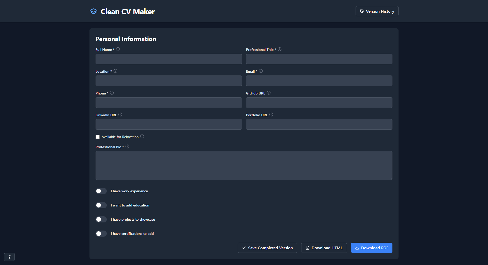
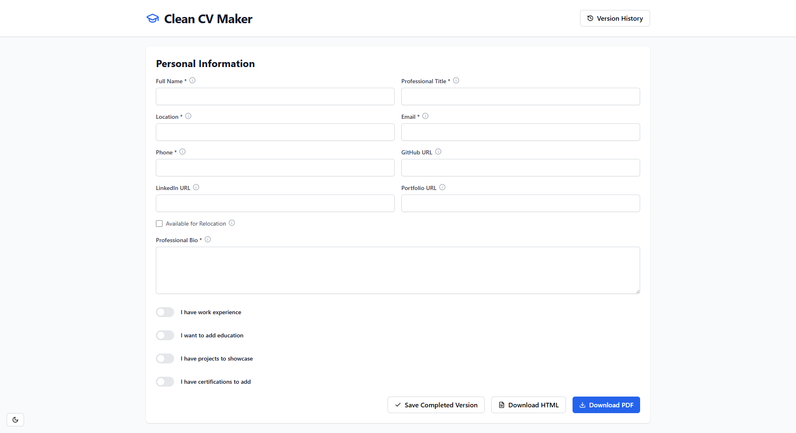

# Clean CV Maker

📝✨ **Clean CV Maker** is a sleek and efficient tool for easily generating professional, minimalist CVs. Built with **React (Vite)**, **Tailwind CSS**, and **Lucide icons**, it delivers a modern, responsive user experience.

📄 **Export Options**  
Generate your CV with flexibility — export to:

- PDF 🧾 for easy sharing or printing.
- HTML 🌐 for custom styling or embedding into websites.
- JSON 🧬 to save your data structure, re-import later, or share with others.

🗂️ **Version Management**  
Craft and manage **multiple versions** of your CV effortlessly. Each version is saved locally using `localStorage` and supports two distinct stages:

- **Draft** 📝: For ongoing edits and previews.
- **Complete** ✅: Finalized versions ready for export.

🌍 **Multilingual Support**  
Clean CV Maker is designed with global users in mind. It currently includes support for the following languages (all `common` and `form` strings — the namespaces the app actually renders — are fully translated):

- 🇸🇦 **AR** (Arabic) — ✅ 
- 🇩🇪 **DE** (German) — ✅ 
- 🇺🇸 **EN-US** (English - US) — ✅ Default language 
- 🇪🇸 **ES-ES** (Spanish - Spain) — ✅ 
- 🇫🇷 **FR** (French) — ✅ 
- 🇮🇳 **HI** (Hindi) — ✅ 
- 🇮🇹 **IT** (Italian) — ✅ 
- 🇯🇵 **JA** (Japanese) — ✅ 
- 🇰🇷 **KO** (Korean) — ✅ 
- 🇧🇷 **PT-BR** (Portuguese - Brazil) — ✅ 
- 🇷🇺 **RU** (Russian) — ✅ 
- 🇺🇦 **UK** (Ukrainian) — ✅ 
- 🇵🇰 **UR** (Urdu) — ✅ 
- 🇨🇳 **ZH-CN** (Chinese - Simplified) — ✅ 

Want to help improve translations? Check our [contribution guidelines](CONTRIBUTING.md) and help make Clean CV Maker more accessible to users worldwide!🌐✨

> **Note for maintainers:** every locale also has `certifications.ts`, `education.ts`, `projects.ts`, and `work-experience.ts` files with full translations, but these namespaces aren't imported into `src/i18n/index.ts` or consumed by any component yet — the app currently only loads `common` and `form`. Wire them up (or remove them) as part of a future i18n cleanup. Separately, `pt-BR/form.ts` has 22 extra keys (`experienceYears`, `projectsWorked`, `languages` sub-sections) that don't exist in the English source and aren't referenced by any component either — worth reconciling once that content is either wired in or dropped.

---

## 📁 Project structure

```
📂 src
 ├── 📄 App.tsx
 ├── 📄 index.css
 ├── 📄 main.tsx
 ├── 📄 vite-env.d.ts
 │
 ├── 📂 components
 │   ├── 📄 CertificatesForm.tsx
 │   ├── 📄 CVDocument.tsx
 │   ├── 📄 CVPreview.tsx
 │   ├── 📄 EducationForm.tsx
 │   ├── 📄 ExperienceForm.tsx
 │   ├── 📄 PersonalInfoForm.tsx
 │   ├── 📄 ProjectsForm.tsx
 │   ├── 📄 VersionPanel.tsx
 │   │
 │   ├── 📂 certificates
 │   │   └── 📄 CertificateFields.tsx
 │   │
 │   ├── 📂 education
 │   │   └── 📄 EducationFields.tsx
 │   │
 │   ├── 📂 experience
 │   │   ├── 📄 ExperienceFields.tsx
 │   │   ├── 📄 RoleFields.tsx
 │   │   └── 📄 RolesSection.tsx
 │   │
 │   ├── 📂 form
 │   │   ├── 📄 AutoSaveTooltip.tsx
 │   │   ├── 📄 CollapsibleSection.tsx
 │   │   ├── 📄 ExperienceYearsSection.tsx
 │   │   ├── 📄 FormActions.tsx
 │   │   ├── 📄 FormCheckbox.tsx
 │   │   ├── 📄 FormField.tsx
 │   │   ├── 📄 LanguagesSection.tsx
 │   │   ├── 📄 PersonalInfoSection.tsx
 │   │   ├── 📄 PreviewSection.tsx
 │   │   └── 📄 ProjectsWorkedSection.tsx
 │   │
 │   ├── 📂 projects
 │   │   ├── 📄 ProjectFields.tsx
 │   │   └── 📄 TechStackSelect.tsx
 │   │
 │   ├── 📂 ui
 │   │   ├── 📄 Button.tsx
 │   │   ├── 📄 Collapsible.tsx
 │   │   ├── 📄 Footer.tsx
 │   │   ├── 📄 LanguageSelector.tsx
 │   │   ├── 📄 Switch.tsx
 │   │   ├── 📄 ThemeToggle.tsx
 │   │   └── 📄 Tooltip.tsx
 │   │
 │   └── 📂 version
 │       ├── 📄 ImportSection.tsx
 │       ├── 📄 RenameDialog.tsx
 │       └── 📄 VersionCard.tsx
 │
 ├── 📂 i18n
 │   ├── 📄 index.ts
 │   └── 📂 locales
 │       ├── 📂 en, pt-BR, de, fr, etc.
 │       └── 📄 common.ts, form.ts, certifications.ts, etc.
 │
 ├── 📂 lib
 │   ├── 📄 html-generator.ts
 │   ├── 📄 utils.ts
 │   ├── 📄 versioning.ts
 │   ├── 📂 hooks
 │   │   └── 📄 useFormValidation.ts
 │   └── 📂 schemas
 │       └── 📄 personal-info.ts
 │
 └── 📂 styles
     └── 📄 variables.css
```

---

## 📸 Preview

### 🌙 Dark Mode



### ☀️ Light Mode



---

## 🚀 Features

- 📝 **Dynamic form** – Structured input for CV details.
- 🔗 **LinkedIn integration** – Fetch work experiences and certificates.
- 💾 **Data storage** – Save CVs in `localStorage` or sync with GitHub.
- 📄 **PDF generation** – Clean and customizable layouts.
- 🎨 **Minimalist design** – Powered by Tailwind CSS and Lucide icons.

---

## 🛠 Tech Stack

- ⚛ **React (Vite)** – Fast and modern React development.
- 🎨 **Tailwind CSS** – Utility-first styling for a clean UI.
- 🖼 **Lucide Icons** – Simple, elegant icons.
- ⚡ **VITE SWC** – Lightning-fast builds and optimizations.

---

## 📌 Getting Started

### ✅ Prerequisites

Ensure you have the following installed:

- **Node.js** (v18+ recommended)
- **pnpm** (or npm/yarn as alternatives)

### 📥 Installation

Clone the repository and install dependencies:

```sh
git clone https://github.com/guibranco/clean-cv-maker.git
cd clean-cv-maker
pnpm install  # or npm install / yarn install
```

### 🏃 Running the App

Start the development server:

```sh
pnpm dev  # or npm run dev / yarn dev
```

### 📦 Building for Production

Generate optimized production files:

```sh
pnpm build  # or npm run build / yarn build
```

---

## 🤝 Contributing

Contributions are welcome! Feel free to open issues or submit pull requests. If you’d like to improve the project, follow these steps:

1. Fork the repository.
2. Create a new branch (`feature/your-feature`).
3. Make and commit your changes.
4. Push to your branch and submit a Pull Request.

---

## 📜 License

This project is licensed under the **MIT License** – see the [`LICENSE`](LICENSE) file for details.

---

## 📧 Contact & Support

For questions or feature requests, reach out via [GitHub Issues](https://github.com/guibranco/clean-cv-maker/issues).
