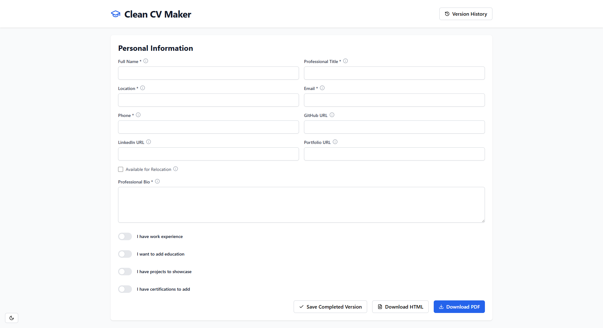

# Clean CV Maker

📝✨ **Clean CV Maker** is a sleek and efficient tool for easily generating professional, minimalist CVs. Built with **React (Vite), Tailwind CSS, and Lucide icons**, it provides a modern user experience with dynamic forms, **LinkedIn integration**, and **PDF export**.

---

## 📸 Preview

### 🌙 Dark Mode  


### ☀️ Light Mode  


---

## 🚀 Features

- 📝 **Dynamic form** – Structured input for CV details.  
- 🔗 **LinkedIn integration** – Fetch work experiences and certificates.  
- 💾 **Data storage** – Save CVs in `localStorage` or sync with GitHub.  
- 📄 **PDF generation** – Clean and customizable layouts.  
- 🎨 **Minimalist design** – Powered by Tailwind CSS and Lucide icons.  

---

## 🛠 Tech Stack

- ⚛ **React (Vite)** – Fast and modern React development.  
- 🎨 **Tailwind CSS** – Utility-first styling for a clean UI.  
- 🖼 **Lucide Icons** – Simple, elegant icons.  
- ⚡ **VITE SWC** – Lightning-fast builds and optimizations.  

---

## 📌 Getting Started

### ✅ Prerequisites  
Ensure you have the following installed:  
- **Node.js** (v18+ recommended)  
- **pnpm** (or npm/yarn as alternatives)  

### 📥 Installation  
Clone the repository and install dependencies:  

```sh
git clone https://github.com/guibranco/clean-cv-maker.git
cd clean-cv-maker
pnpm install  # or npm install / yarn install
```

### 🏃 Running the App  
Start the development server:  

```sh
pnpm dev  # or npm run dev / yarn dev
```

### 📦 Building for Production  
Generate optimized production files:  

```sh
pnpm build  # or npm run build / yarn build
```

---

## 🤝 Contributing

Contributions are welcome! Feel free to open issues or submit pull requests. If you’d like to improve the project, follow these steps:

1. Fork the repository.  
2. Create a new branch (`feature/your-feature`).  
3. Make and commit your changes.  
4. Push to your branch and submit a Pull Request.  

---

## 📜 License

This project is licensed under the **MIT License** – see the [`LICENSE`](LICENSE) file for details.

---

## 📧 Contact & Support

For questions or feature requests, reach out via [GitHub Issues](https://github.com/guibranco/clean-cv-maker/issues).
